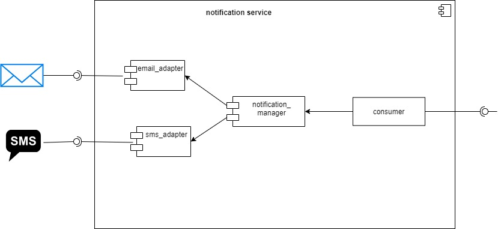

# README.md Microservicio de notificaciones  

Este microservicio sirve para notificar a los usuarios por medio de canales como email 
y sms, cabe recalcar que a futuro se le puede integrar mas canales. 

# DIAGRAMAS 

