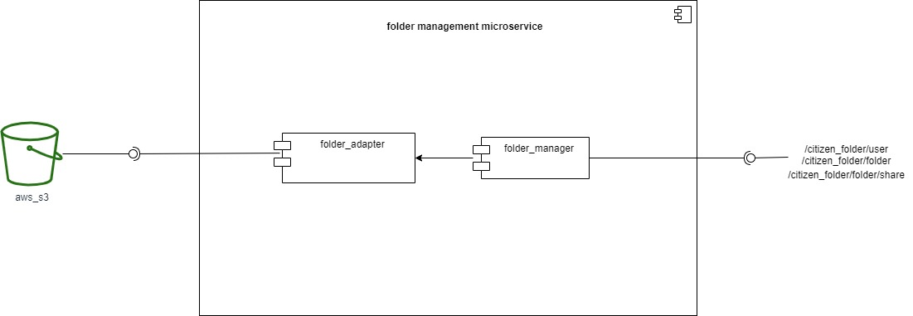

# README.md FOLDER MANAGEMENT MICROSERVICE

With this microservice you can create folders, upload files, download files, delete files, 
update files, share files and list directories.

# DIAGRAMS

# ARCHIVOS 
*  code #All the code that makes up the microservice
    * folder_adapter.py #folder adapter
    * folder_manager.py  #folder_manager
* configuration 
    * Dockerfile #To build the microservice image
    * environment_variable.env  #To set environment variables
* diagrams  

