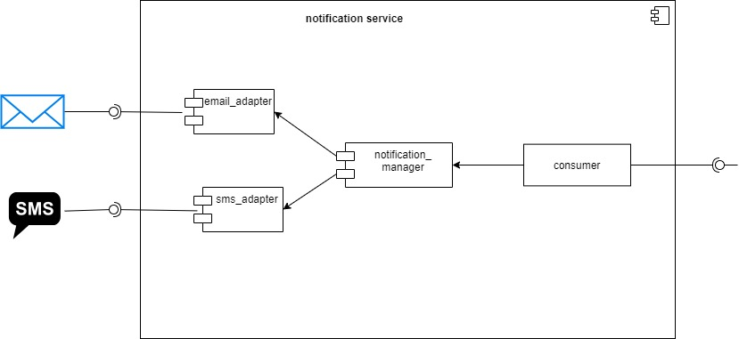

# README.md NOTIFICATION MICROSERVICE

This microservice serves to notify users through channels such as email and sms. 
and sms, it should be noted that more channels can be integrated in the future. 

# DIAGRAMS

# ARCHIVOS 
*  code #All the code that makes up the microservice
    * consumer_rabbitmq.py #Connection and consumption of messages arriving at the rabbitmq server  
    * email_adapter.py  #email adapter 
    * notification_manager.py #notification manager
    * sms_adapter.py #sms adapter 
* configuration 
    * Dockerfile #To build the microservice image
    * environment_variable.env  #To set environment variables
* diagrams  

